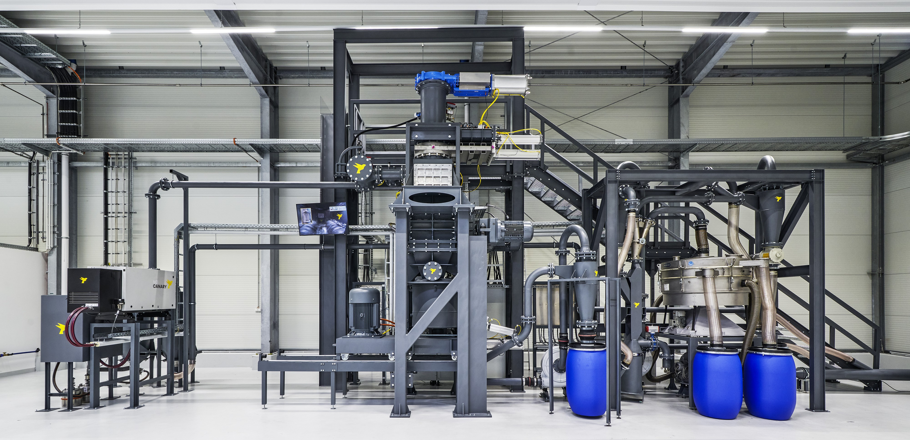

Website Content Management Guide

Welcome to the documentation for the Virtual Learn Station website. This guide is designed for non-developers and will walk you through how to update text, images, and videos, as well as how to create new pages.

1. Understanding the Folder Structure

The project is organized into a few key folders. Understanding what each one does will help you find the files you need to edit.

/assets/: This is where all your media files are stored.

/assets/images/: Contains all standard images, like logos and background photos.

/assets/icons/: Contains the green and gray navigation icons for the header.

/assets/videos/: Contains all video files used in the modals.

/css/: Contains the main stylesheet (custom.css). You won't need to edit this file for content changes.

/js/: Contains the JavaScript files that add interactivity. You won't need to edit these files.

/pages/: This is the most important folder. It contains the website's pages and reusable parts.

/pages/oprt/: Contains all pages related to the "Operations" section, including its specific header.

/pages/envr/: (Example) A place for a future "Environment" section with its own pages and header.

_footer.html: The shared footer file used on all pages.

2. How to Edit the Website Content

The website is built from reusable parts (like the header) and individual pages that use them.

2.1. The Landing Page (index.html)

This is the first page users see. It's located in the main project folder.

To change the main headline and subtitle:
Open index.html and edit the text inside these tags:

<h1 class="text-5xl font-bold text-white">
    Willkommen bei der Lernfabrik
</h1>

    Ihre interaktive Lernumgebung für industrielle Prozesse.

To change the background image:

Place your new image in the /assets/images/ folder.

In index.html, update the url() in this line:

To change the loading status text:
Edit the text inside the  tag:

Place an object to start the learn station

2.2. The Header & Navigation (/pages/oprt/oprt_header.html)

This file controls the circular navigation bar for all pages within the /pages/oprt/ folder.

To change an icon:

Place your new color icon (e.g., new_icon_color.png) and gray icon (e.g., new_icon_gray.png) in the /assets/icons/ folder.

In oprt_header.html, find the link you want to change and update the src, data-inactive-src, and data-active-src paths.

To change which page an icon links to:
Update the href attribute in the <a> tag:

<a href="/pages/oprt/your-new-page.html" class="nav-tab ...">
    ...
</a>

To add or remove a step in the navigation:
Simply copy and paste (or delete) an entire <a>...</a> block. The JavaScript will automatically handle the circular logic. Make sure to update the href and image paths for any new link.

To create a header for a new section (e.g., "Environment"):

Duplicate the oprt_header.html file.

Rename it (e.g., envr_header.html) and place it in the new folder (e.g., /pages/envr/).

Edit this new file to include the links and icons for the "Environment" section.

2.3. Main Content Pages (e.g., /pages/oprt/oprt-mt.html)

This is the template for your main content pages. All pages with a header, hotspots, and tabs will follow this structure.

To change the page title:
Edit the <title>...</title> tag at the top of the file.

To change the main headline and description:
Edit the text inside the <h1 id="main-headline"> and the 
 tag that follows it.

To change the main image with hotspots:

Place your new image in /assets/images/.

Update the src attribute in the  tag.

Note: The hotspot positions (top, left) may need to be adjusted by a developer if the image layout changes significantly.

To change hotspot information:
Find the <button class="hotspot"...> you want to edit and change the data-title and data-text attributes.

<button class="hotspot ..." data-title="New Title Here" data-text="New description text for the popup.">
    01
</button>

To edit the scrolling feature tabs:
Find the section with id="tab-container". To change the text for a tab, edit it directly.

    <h4 class="font-bold text-xl">New Title for Tab 1</h4>
    
New description for tab 1.

To edit the content that appears when a tab is clicked:

Find the section with id="tab-content-container".

Locate the content block with the matching data-tab attribute (e.g., data-tab="feature1").

Edit the headlines (<h2>), paragraphs (
), and image thumbnails () inside this block.

To change the video for a specific tab:
Find the 
 with the class open-video-modal-trigger inside the tab's content block and update the data-video-src path.

    ...

3. How to Create a New Page

Creating a new page is a simple process of copying a template and updating it.

Duplicate an Existing Page:

Go to the folder where you want the new page to live (e.g., /pages/oprt/).

Make a copy of an existing file like oprt-mt.html.

Rename the New File:

Rename the copy to something descriptive (e.g., oprt-new-process.html).

Link the Correct Header:

Open the new file. At the top, find the header-placeholder div.

Make sure the data-header-src path points to the correct header for this section (e.g., /pages/oprt/oprt_header.html).

Update All Content:

Go through the new file and change all the text, images, and videos as described in section 2.3.

Link to the New Page:

Open the header file for this section (e.g., oprt_header.html).

Find the icon that should link to your new page and update its href attribute to point to your new file name.

<a href="/pages/oprt/oprt-new-process.html" class="nav-tab ...">
    ...
</a>
